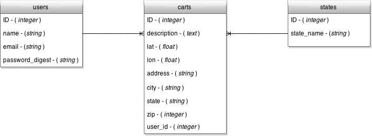

##Application Description

###Fruit Cart Finder
Finding healthy snacks can be tough proposition these days. Sodas, chips and candy bars call out to us from every direction. Obesity, diabetes and heart disorders are on the rise. Humans are programmed to seek out sugars, fats and high calorie foods because of their relative scarcity in nature. Modern humans need an old school solution...natural foods.

Access to fresh fruits as healthy alternatives can be tricky to locate in a city full of hotdog carts and halal trucks. The Fruit Cart Finder solves that problem. Finding a local fruit merchant is as simple as finding your location on a map and checking which vendor is closest to you. Have a favorite fruit cart? Simply sign up for a free fruit cart finder account and add them to the database for others to discover and enjoy.

##Technology Used
+ Ruby on Rails
+ JQuery Ajax
+ Postgresql - Database
+ HTML & CSS
+ Draw.io - ERD
+ Balsamiq - Wireframes

##Trello Board
<a href="https://trello.com/b/PsdLDChK/project-4-fruit-cart-finder" target="_blank">Fruit Cart Finder Trello</a>

##Artifacts
###Wireframes

###ERD

###Tables

#### Users Table
|id   |name| email  |password_digest   |
|---|---|---|---|
| 1  |Johnny Appleseed| Japple@gmail.com  |apple   |
| 2  |Anna Bannana| Abannana@gmail.com  | bannana  |
| 3  | Manny Mango| Mmango@gmail.com  | mango |

#### Carts Table
|id|description|lat|lon|address|city|state|zip|user_id|
|:-:||---|---|---|---|---|---|---|:-:|
|1|My fav in the whole area. super friendly  vendor.|40.755313|-73.973238|517 Lexington Ave|N.Y.|N.Y.|10017|1|
|1|Always fresh. This guy is great.|40.768057|-73.985571|363 W 57th|N.Y.|N.Y.|10019|2|
